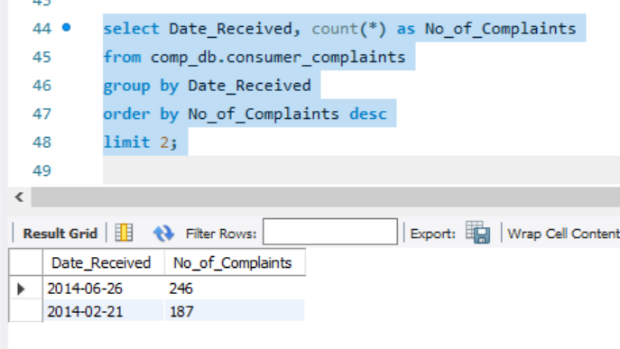

# SQL-Consumer-Complaint

---

## Introduction
As a Data Analyst working for the Consumer Financial Protection Bureau under a Government Agency, I was granted access to a database file called “ComplaintsDB.sql” with consumer complaints received by financial institutions in 2013 – 2015. 

## Data Source
This Data was gotten from the Consumer Complaint Database. 

## Problem Questions
1. Find out how many complaints were received and sent by CFPB on the same day.
2. Get the top 3 products that had complaints received and sent on the same day.
3. Get the top 5 issues received and sent by CFPB on the same day.
4. Get the top 5 companies targeted that the complaints were received and sent by CFPB 
on the same day.
5. Get the top 3 companies with the invest number of complaints.
6. List the two dates CFPB had the most issues received.
7. List the two dates CFPB had the lowest number of issues received.
8. Which mode of communication had the most complaints submitted with?
9. List two states with the most complaints received by CFPB.
10. Which state had the most complaints received as regards "students’ loan" in the product 
name field?
11. List two companies having the most consumer disputed as "yes".

## Answers
1.	A total of 28737 complaints were received and sent on the same day.

2. Mortgage, Debt collection and Credit reporting were the Top 3 Products with the most complaints received and sent on the same day with each product having a total number of complaint as 7998, 7413 and 5793 respectively.

3. Incorrect information on credit report; Loan modification, collection, foreclosure; Loan servicing, payments, escrow account; Cont’d attempts debt not owed and Communication tactics were the top 5 issues received and sent on the same day with 3799, 3589, 3203, 3180 and 1248 complaints respectively.

4.	Equifax, Experian, Bank of America, Wells Frago & Company and TransUnion Intermediate Holdings, Inc. were the top 5 companies that complaints were targeted at with 2100, 2002, 1880, 1586 and 1544 complaints respectively were received and sent on the same day.

5.	Associated Mortgage Corporation, Partners for Payment Relief and Healthcare Receivable Professionals, LLC are the top 3 companies with the least number of complaint, with each company having just one complaint.

6. 26th June, 2014 and 21st February, 2014 were the dates that received the most complaints, each date received 246 and 187 complaints respectively.

7.	2nd September, 2015 and 5th June, 2015 were the dates that received the least complaints, with only one complaint per date.

8.	The mode of communication with the highest number of complaints was via Web, with 44904 complaints. 

9.	California and Florida were the states with the most complaints, each state had 9255 and 6306 complaints respectively.

10.	California had the most complaint on student loan with 163 complaints.

11.	Bank of America and Equifax were the companies with the most number of consumer dispute as Yes, they had 1069 and 962 respectively.

---
## Conclusion
The analysis provided valuable insights to answer crucial questions and it also provided wholistic understanding of the challenges faced by customers. Bank of America, California and Web channel had the most complaints for company, state and mode of communication respectively. With the help of these findings, customer services and complaints will be properly managed thereby providing excellent customer satisfaction.

